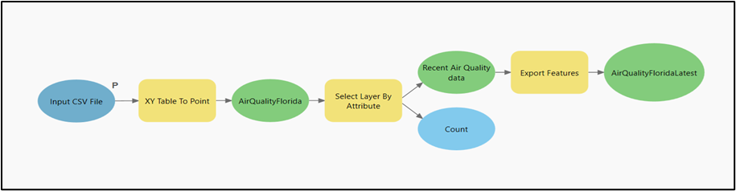
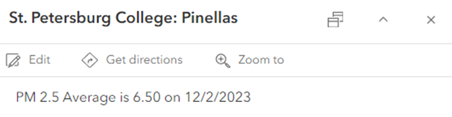
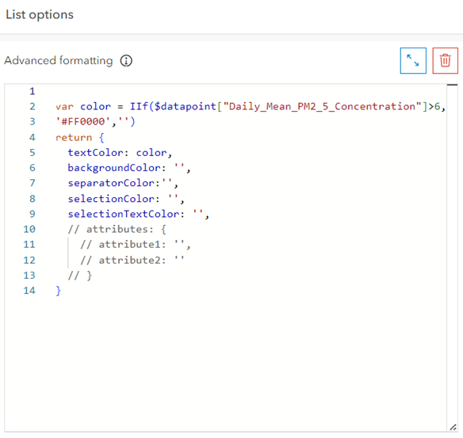
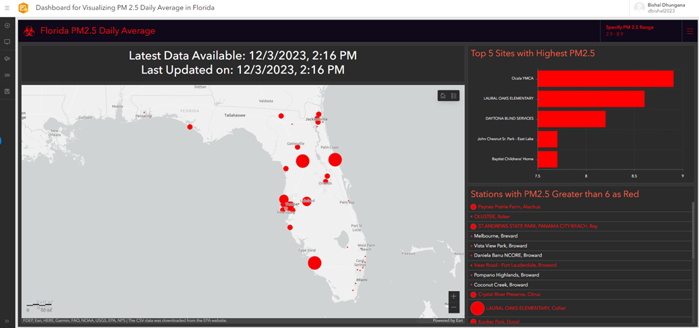
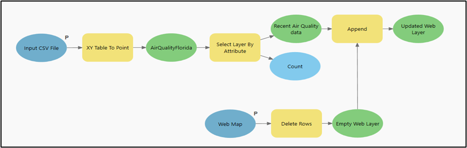

# Air Pollution in Florida: Dashboard for Visualization of Mean Daily Average Fine Particulate Matter (PM2.5) with Automatic Update Tool
Check the final dashboard here: [View Dashboard](https://arcg.is/1yGzfT)

## Introduction
PM2.5 pollution, consisting of fine particulate matter smaller than 2.5 micrometers in diameter, poses a significant threat to public health and the environment (EPA). In the United States, this pollution originates from various sources, including vehicle emissions, industrial processes, and wildfires. Its impact on human health is linked to respiratory issues, cardiovascular problems, and even premature death.

Florida, renowned for its sunshine and natural beauty, faces challenges regarding PM2.5 pollution. While the state generally experiences good air quality, certain urban areas, incredibly densely populated regions, and industrial zones confront elevated levels of PM2.5 (FDEP). Factors like traffic congestion, industrial activities, and occasional wildfires contribute to the heightened presence of these fine particles in the air. Efforts to mitigate PM2.5 pollution in Florida include stringent emission standards, promoting cleaner energy sources, and implementing measures to reduce vehicle emissions. Government initiatives, alongside public awareness campaigns, emphasize the importance of minimizing personal contributions to air pollution. These endeavors aim to safeguard the environment and the health of Florida's residents, ensuring that the state's pristine landscapes continue to thrive while prioritizing the well-being of its inhabitants.

In this report, I have developed an ArcGIS dashboard using Esri Suite to visualize the most recent PM2.5 concentration in 48 air quality monitoring stations in Florida. I used the automatic approach to update the web layer for the latest date and time to interactively show dynamic characteristics of the PM2.5 pollution in near real-time. This will help to understand the most recent and the most polluted areas across the state and apply mitigation measures accordingly.

## Software and Dataset Used
In this analysis, I used the daily average outdoor air quality data from the United States Environmental Protection Agency (EPA) from [EPA Outdoor Air Quality Data](https://www.epa.gov/outdoor-air-quality-data/download-daily-data). I used ArcGIS Pro 3.2 for data preprocessing and web layer upload and update and ArcGIS Online for preparing the web map and dashboard.

## Methodology
The aim was to preprocess this data, create a web layer, generate a web map, and develop a dashboard for visualizing the air quality trends in the region. An ArcGIS tool using ModelBuilder was also constructed to update the web layer with the most recent EPA CSV files, ensuring the dashboard reflects the latest air quality information.

### 1. Data Pre-processing and Web Layer Creation
After downloading the data from EPA in CSV format, the first thing to do is load the data in the ArcGIS Pro project and use the XY Table to Point tool to change the CSV file into a point feature class. Then, I used the Select Layer by Attribute tool using the condition `Date = (select max(date) from AirQualityFlorida)` to select the most recent observation by date. The selected features were exported to make a new `AirQualityFloridaLatest` feature and shared as a hosted public web layer in ArcGIS Online.

**Figure 1. Model to preprocess the data.**



### 2. Preparation of Web Map
Using the feature layer, I made a web map, which will later be used in the dashboard to visualize the PM2.5 values in different stations using graduated color symbology. The larger circle represents the higher PM2.5 value. I also made some changes for popups by using the following arcade expression:


**Figure 2. Configuration of Map pop-ups.**


I changed the color of the symbols to red and the base map to Light Gray Canvas and saved the web map as PM2.5 Florida Daily.

**Link to web map: [PM2.5 Florida Daily](https://arcg.is/0yeO5y0)**

### 3. Preparation of Dashboard
Using the web map I built as the map reference and web layer data, I finally developed a dashboard using the black theme. Apart from the map, I added a list containing the names of all the air quality stations, in which stations with PM2.5 values greater than 6 are in red. I used the following arcade expression to give it a title of color Tomato: 
```html
<h3 style="color: Tomato">Stations with PM2.5 Greater than 6 as Red</h3>
```
**Figure 3. Arcade Expression for symbolizing list**


Also, with the header, I used the Number Selector slider to specify the range of values so that it renders the map and the list. 

I also added a Serial Chart to show the top 5 sites with the highest value of PM2.5, making it easier to decide the priority areas. The chart's purpose is similar to that of the list, but it highlights the most polluted neighborhood in terms of PM2.5, unlike the list, which highlights all the areas with a PM2.5 concentration value greater than 6.

Finally, I added an indicator to show the latest available data date and time and the last updated time to make it more interactive and up-to-date.

[Link to the dashboard](https://arcg.is/1yGzfT)

**Figure 4. The front of the dashboard**


### 4. Update the Dashboard with the Most Recent Data

Finally, once the dashboard was done, I saved it as a Dashboard for Visualizing the PM 2.5 Daily Average in Florida and made it public. In addition, I aim to provide the latest air quality data through this dashboard. To achieve this, I modified the tool I initially made in ArcGIS Pro to semiautomatically update the web layer with a new CSV file to provide the latest data. I modified the initial tool to clear the row of the web layer using the Delete Rows tool in ArcGIS Pro and append it with the latest data from the CSV file to populate it with the most recent data.

**Figure 6. Tool to automate the update of most recent air quality data in the web layer**

We can also schedule the process by scheduling the tool for a specific time with our time interval (hourly, daily, weekly, etc). In this way, we can automate the visualization in the dashboard using ArcGIS Pro.

### Results and Conclusion

ArcGIS Pro and ArcGIS Online can be connected using the Esri account, making it possible to make changes to the web layer using ArcGIS Pro. Figure 5 shows that as of December 3, 2023, 2:16 PM, Olca YMCA in Marion County has the highest PM2.5 concentration value (8.90). Surprisingly, the southern coastal cities such as Miami don’t have that much PM2.5 pollution. In this way, we can analyze the pollution of PM2.5 using the dashboard, which can also be used for other datasets.

The shortcoming of this dashboard is that we must download the CSV file each time and feed it into the model; everything else is automated. I couldn’t find free APIs to directly provide the data into ArcGIS Online due to time limitations for the project and limited access to my ArcGIS privileges.

### References:

- [EPA - Particulate Matter (PM2.5) Trends](https://www.epa.gov/air-trends/particulate-matter-pm25-trends)
- [Florida's Air Quality](https://floridadep.gov/air/air-monitoring/content/floridas-air-quality)
- [EPA - Download Daily Data](https://www.epa.gov/outdoor-air-quality-data/download-daily-data)

